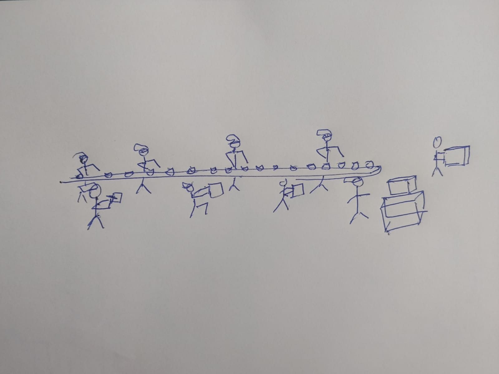
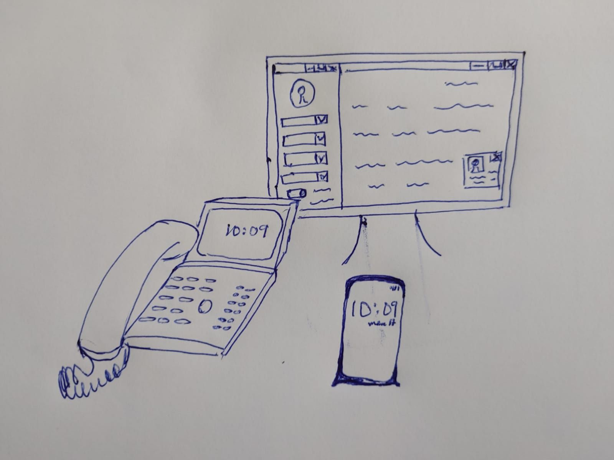
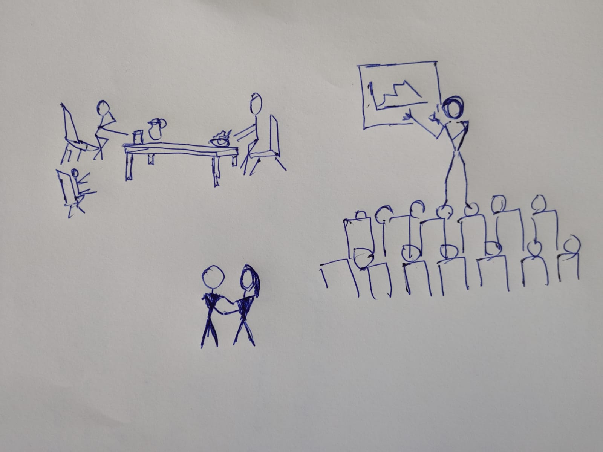
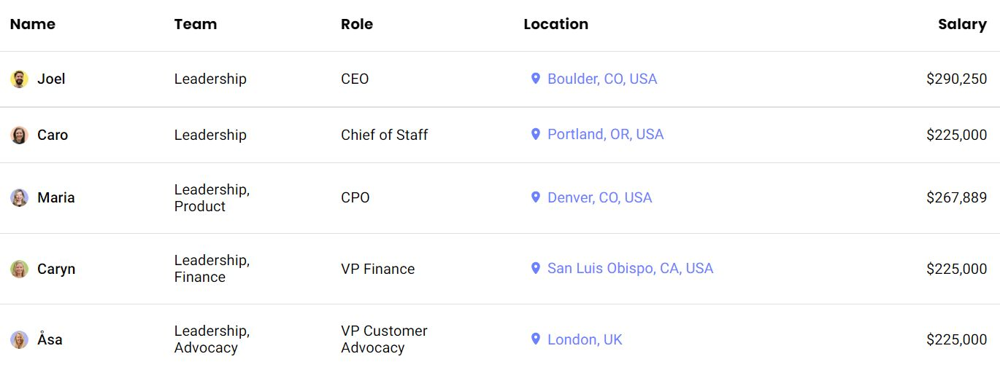
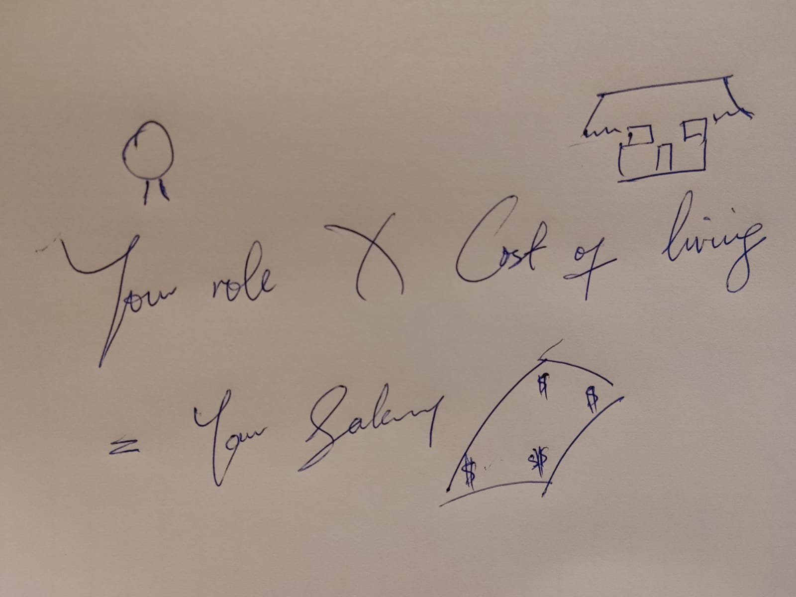
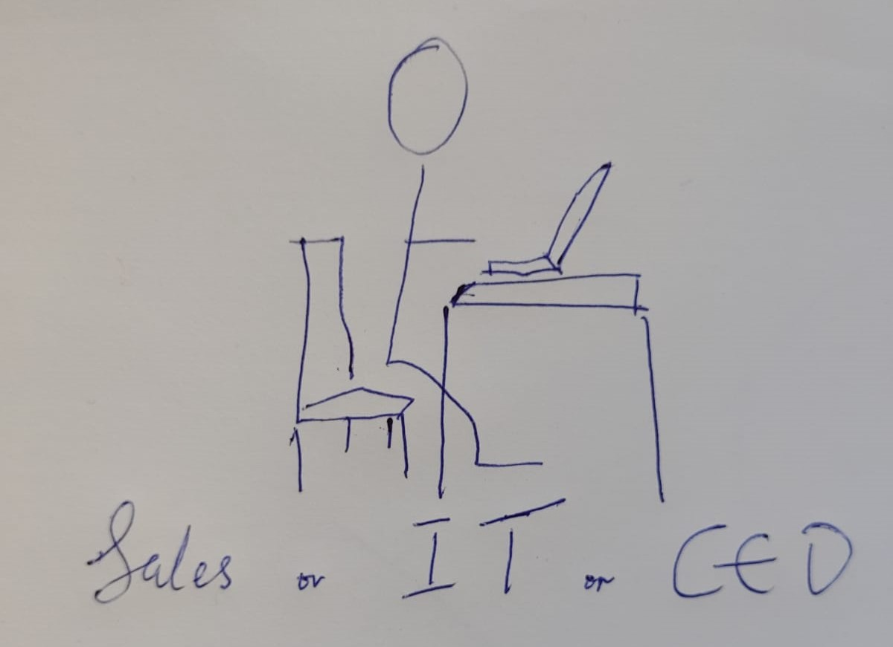
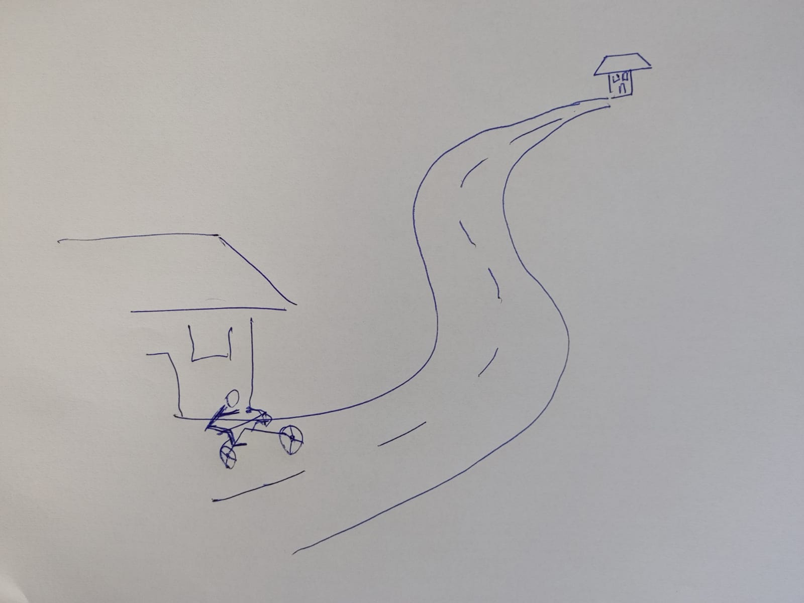
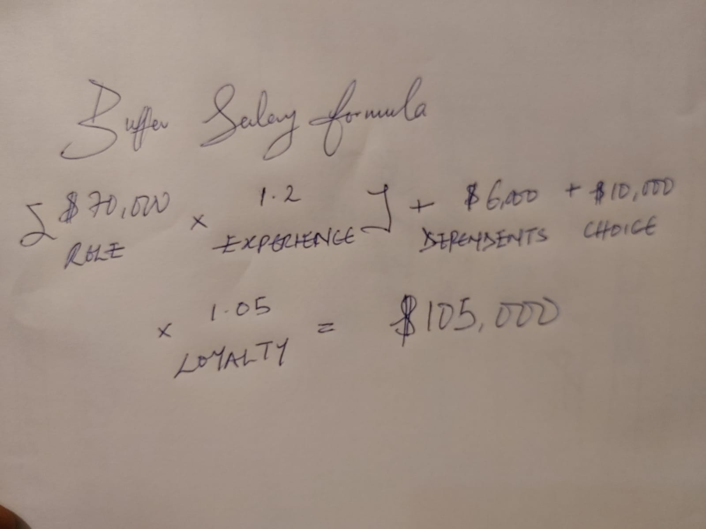

<!-- .slide: data-background="./01.jpg" -->

Morningstar, Sipgate & Buffer (Including Salary system)

By OBUROH ORITSEBAMIGHO O.

---

<!-- .slide: data-background="./01.jpg" -->

#### Morningstar

Morning Star has become the worldwide market leader in tomato processing with total revenues close to 1Billion USD annually.

## 

---

<!-- .slide: data-background="./01.jpg" -->

#### Morning Star's Success: No Bosses, No Titles, No Structural Hierarchy.

1. The right mind-set (All interactions should be voluntary & honor your commitments)
2. Collective of mission statements
3. Colleague Letter of Understanding (CLOU)
4. A clear process to resolve conflicts
5. A trusting leader

## 

---

<!-- .slide: data-background="./01.jpg" -->

### Challenges morningstar faces

1. Long on-boarding process
1. Unlearning is hard
1. Self-management is tough

## 

---

<!-- .slide: data-background="./01.jpg" -->

### Sipgate

Sipgate is one of Germany's largest VoIP service providers for consumers and small businesses. They use lean and agile system since 2010.

---

<!-- .slide: data-background="./01.jpg" -->

### Be ready to learn!

Further education, training, conferences, courses, workshops, trainings, presentations, hackathons, books: Bringing external knowledge into the company is very important to us.

During First months Onboarding, a mentor would be asssigned to you (includes ScrumMaster program).

Preparing your own workshop, writing a post for our company blog or giving a lecture in our Event Series LeanDUS are further ways to dive even deeper into a topic.

---

<!-- .slide: data-background="./01.jpg" -->

### How

- Dining with Colleagues at the resturant
- "Open Friday" (every second Friday) reveals
- Workplace is not JUST about work

---

<!-- .slide: data-background="./01.jpg" -->

### Buffer

Buffer is a software application for the web & mobile, designed to manage accounts, by providing the means for a user to schedule social media post, as well as analyze results and engage with their community. Total revenue of 19.40 million annually.

---

<!-- .slide: data-background="./01.jpg" -->

## Why reveal information to the world

- Transparent
- Simple
- Fair
- Generous

## 

---

<!-- .slide: data-background="./01.jpg" -->

### Buffer Transparent Salary System

 Buffer Transparent Salaray system started 2013 

## 

---

<!-- .slide: data-background="./01.jpg" -->

### Salary Formula

---

<!-- .slide: data-background="./01.jpg" -->

### Your Role

**We benchmark for position and experience level**

---

<!-- .slide: data-background="./01.jpg" -->

### Cost of Living

**Apply cost of living based on your location**

---

<!-- .slide: data-background="./01.jpg" -->

## How

- Role — talent markets matter
- Experience — how good you are at what you do matters.
- Dependents — the social dynamic that you live in matters.
- Loyalty — loyalty matters.
- Choice — your risk tolerance matters.

---

<!-- .slide: data-background="./01.jpg" -->

## Your Salary

**Determine a formula-based salary**

## 

---

<!-- .slide: data-background="./01.jpg" -->

## The Neuroscience of Trust

| Percentage | Description         |
| ---------- | ------------------- |
| 74%        | less stress         |
| 106%       | higher productivity |
| 50%        | less stress         |
| 13%        | fewer sick days     |
| 76%        | more engagement     |
| 29%        | more satisfaction   |
| 10%        | less burnout        |

## 

---

<!-- .slide: data-background="./01.jpg" -->

**Salary formular is under further development to include:**

- Educational level
- Tax

---

<!-- .slide: data-background="./01.jpg" -->

## References

- Buffer **Transparent salaries** Retrieved from: https://buffer.com/salaries
- Paul J. Zak, 2017 **The Neuroscience of Trust** _Employment Engagement_ Retrieved from: https://hbr.org/2017/01/the-neuroscience-of-trust
- Pim, 2016 _Morning Star's Success Story:_ **No Bosses, No Titles, No Structural Hierarchy.** Bucket List. Retrieved from: https://corporate-rebels.com/morning-star/
- Zuzi Sochova, 2020 **Hierarchy** _Agile Scrum_. Rertrived from: https://agile-scrum.com/2020/04/01/hierarchy/

## 

